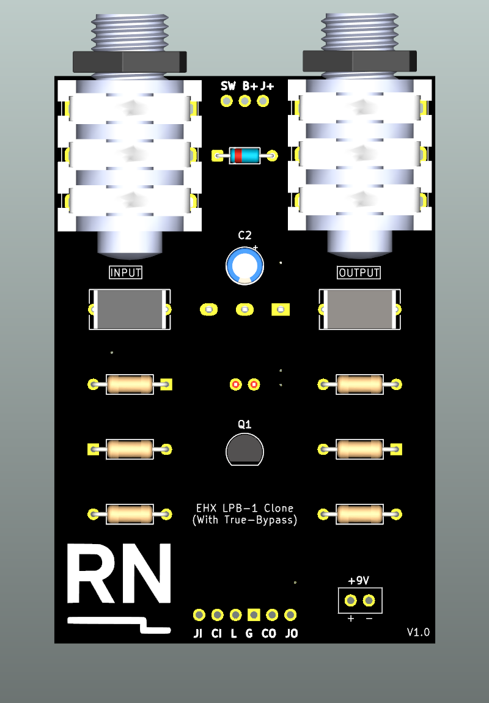
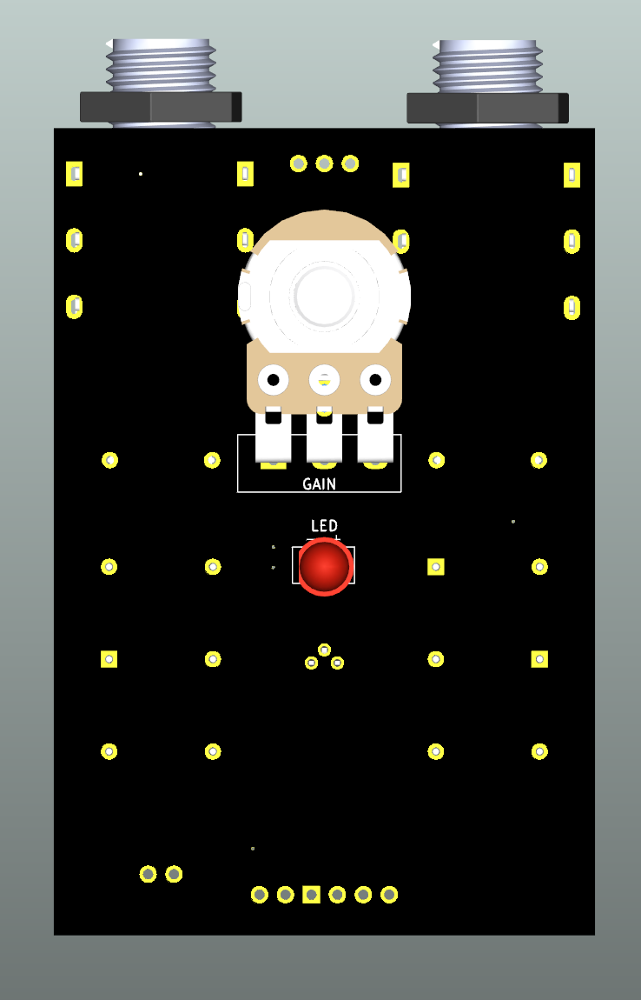
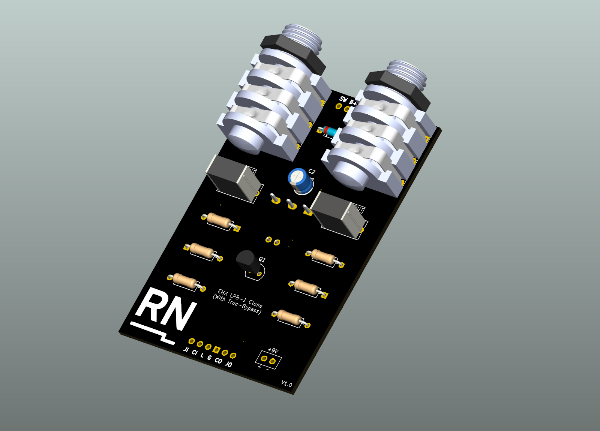
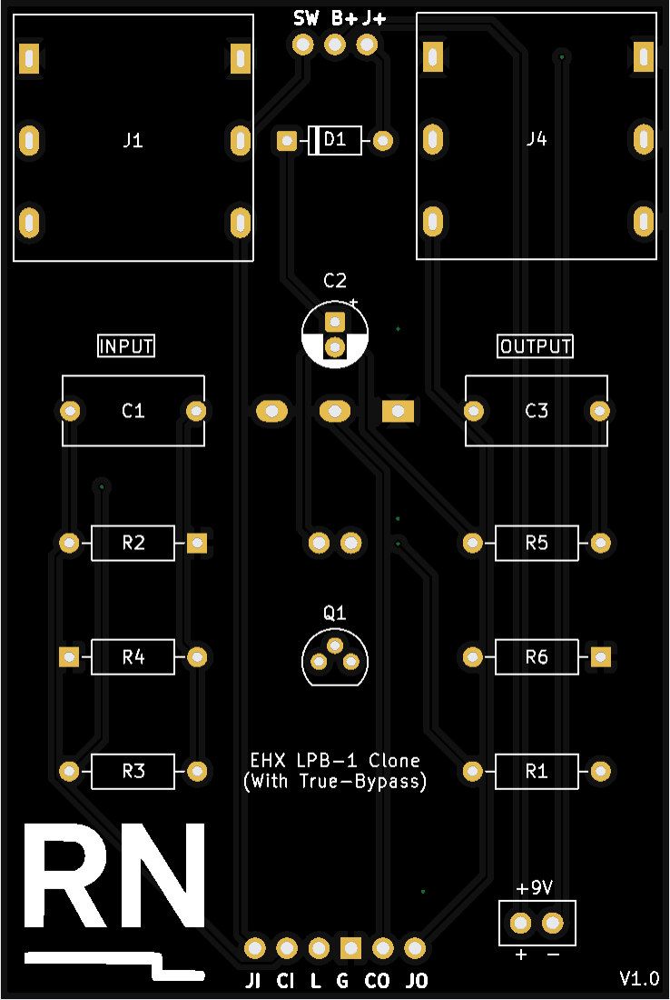
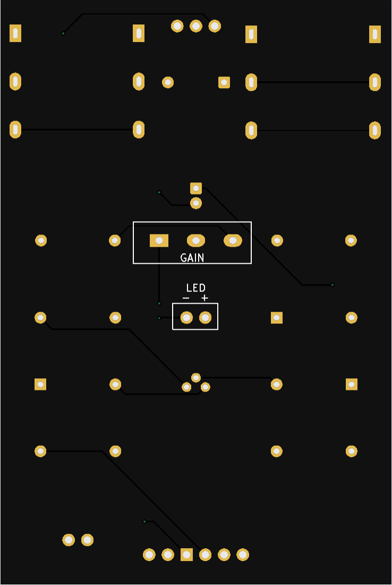
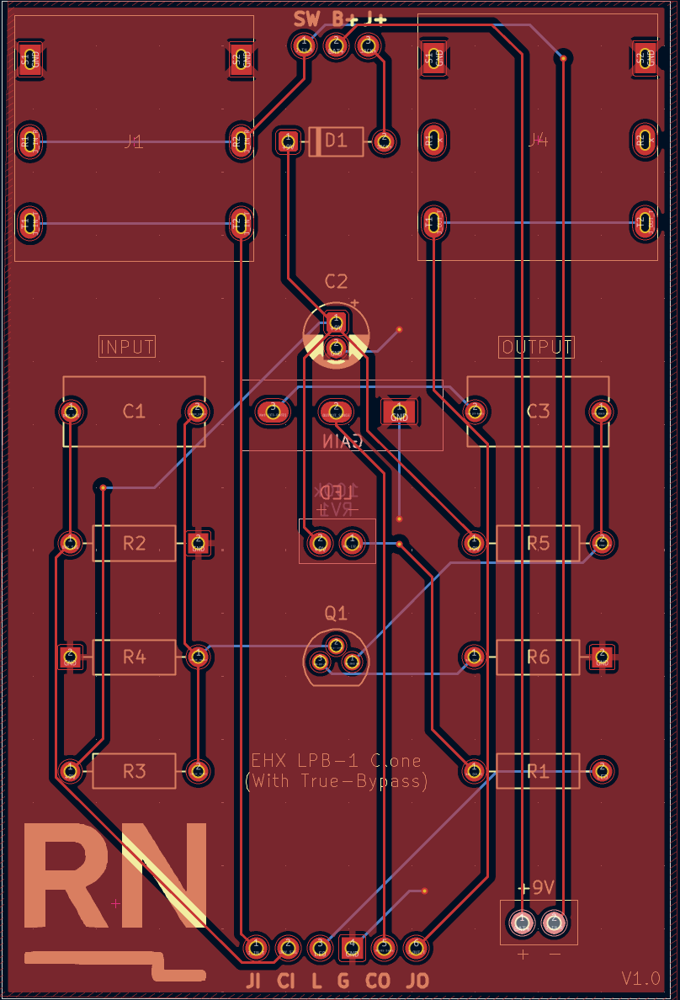

# EHX LPB-1 Clone

A recreation of the Electro-Harmonix LPB-1 (Linear Power Booster), a simple, single-transistor boost pedal, modified for **true-bypass** switching and **input jack power isolation**.  

This version was redesigned in KiCad to practice schematic capture, PCB layout, and design-for-manufacture (DFM) for small analog circuits.

---

## Project Overview

- **Type:** Analog audio effect (booster)  
- **Category:** Classic guitar pedal practice project  
- **Software:** KiCad 9  
- **Fabrication:** JLCPCB (2-layer FR4 board)  
- **Status:** Awaiting PCB fabrication and assembly  

---

## Features

- Compact single-sided through-hole layout  
- **True-bypass** footswitch wiring  
- **Input jack switching** for power isolation when unplugged  
- 9V DC operation with reverse-polarity protection  
- Designed for enclosure integration  

---

## Visuals

### 3D Renders (KiCad)

**Front and Back Views**

| Front | Back |
|:--:|:--:|
|  |  |

**Isometric View**

---

### PCB Layouts

**Front and Back**

| Front | Back |
|:--:|:--:|
|  |  |

**Routing View**

---

## Schematic

- [View PDF](schematics/schematic.pdf)

---

## Learning Objectives

- Improve compact analog PCB layout and signal routing  
- Create and apply custom component footprints  
- Integrate mechanical and electrical constraints for enclosure fit  
- Apply DFM principles for cost-effective fabrication  

---

## Notes

This project is for educational and personal development purposes only.  
It is not affiliated with or endorsed by Electro-Harmonix.  
All schematic capture, layout, and integration were carried out independently.
