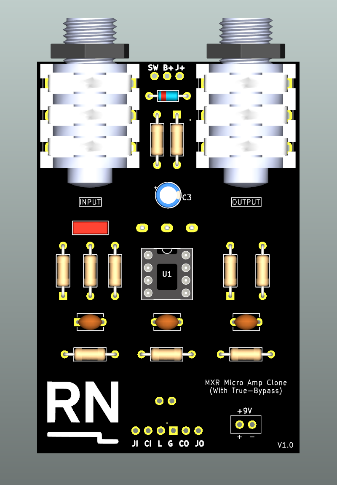
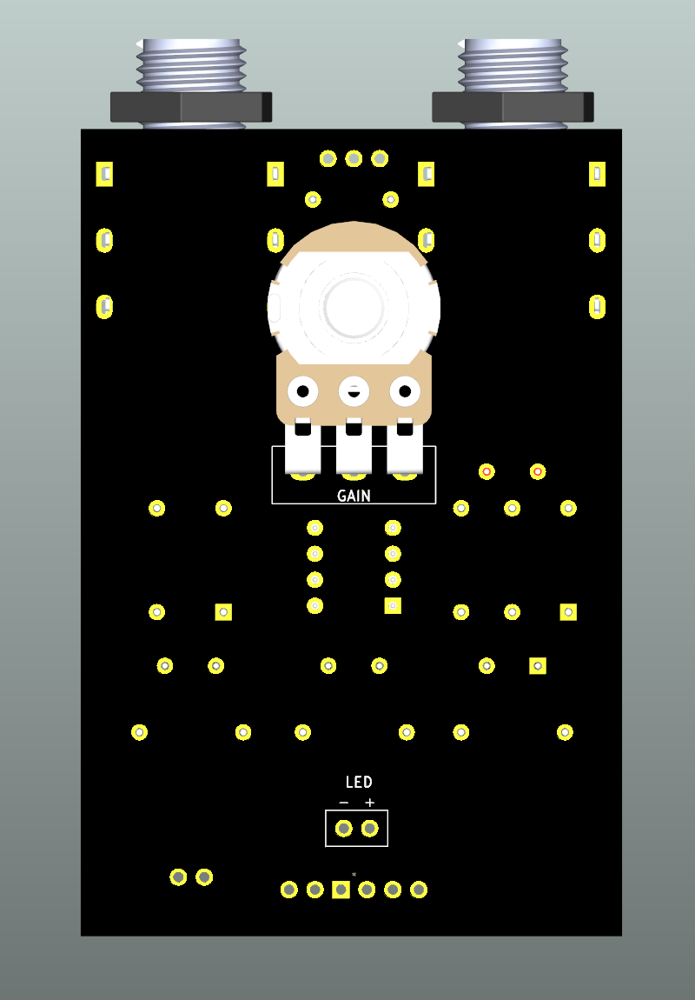
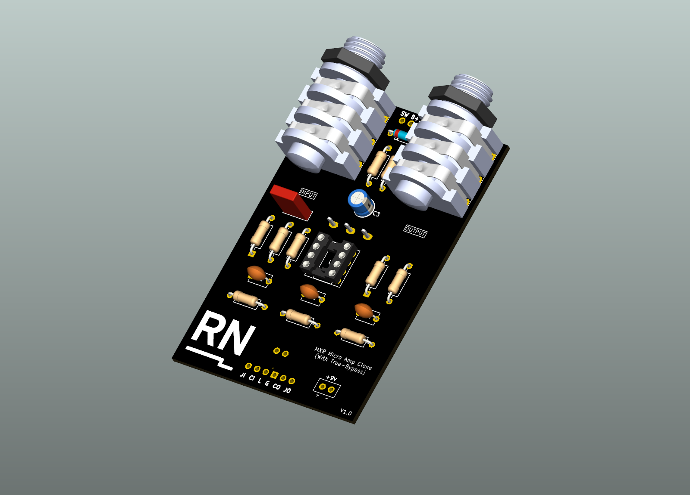
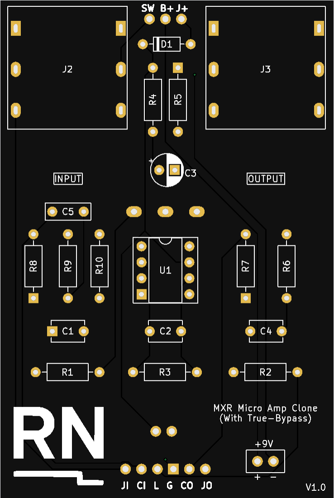
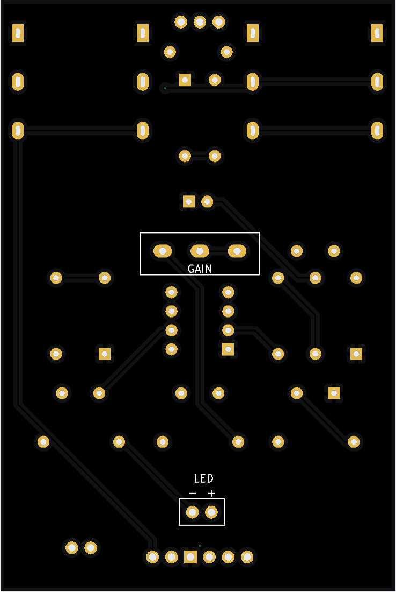
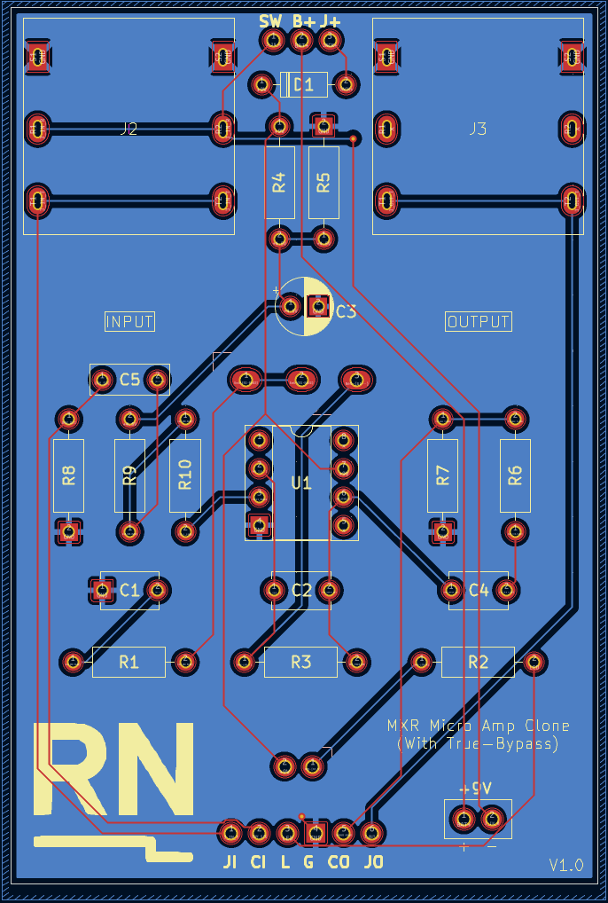

# MXR Micro Amp Clone

A recreation of the MXR Micro Amp, a classic op-amp-based clean boost pedal.  
This version was redesigned in KiCad as a learning project to explore op-amp biasing, signal integrity, and compact PCB layout for analog circuits.

---

## Project Overview

- **Type:** Analog audio effect (clean boost)  
- **Category:** Classic guitar pedal practice project  
- **Software:** KiCad 9  
- **Fabrication:** JLCPCB (2-layer FR4 board)  
- **Status:** Awaiting PCB fabrication and assembly  

---

## Features

- Single op-amp gain stage with stable biasing  
- **True-bypass** footswitch wiring  
- **Input jack power isolation** for battery saving  
- Compact through-hole layout designed for enclosure integration  
- 9V DC operation with reverse-polarity protection  

---

## Visuals

### 3D Renders (KiCad)

**Front and Back Views**

| Front | Back |
|:--:|:--:|
|  |  |

**Isometric View**

---

### PCB Layouts

**Front and Back**

| Front | Back |
|:--:|:--:|
|  |  |

**Routing View**

---

## Schematic

- [View PDF](schematics/schematic.pdf)

---

## Learning Objectives

- Reinforce understanding of op-amp gain stages and bias networks  
- Practice clean analog PCB layout with proper grounding and trace routing  
- Apply DFM principles within standard PCB manufacturing limits  

---

## Notes

This project is for educational and personal development purposes only.  
It is not affiliated with or endorsed by MXR or Dunlop Manufacturing, Inc.  
All schematic capture, layout, and integration were carried out independently.
