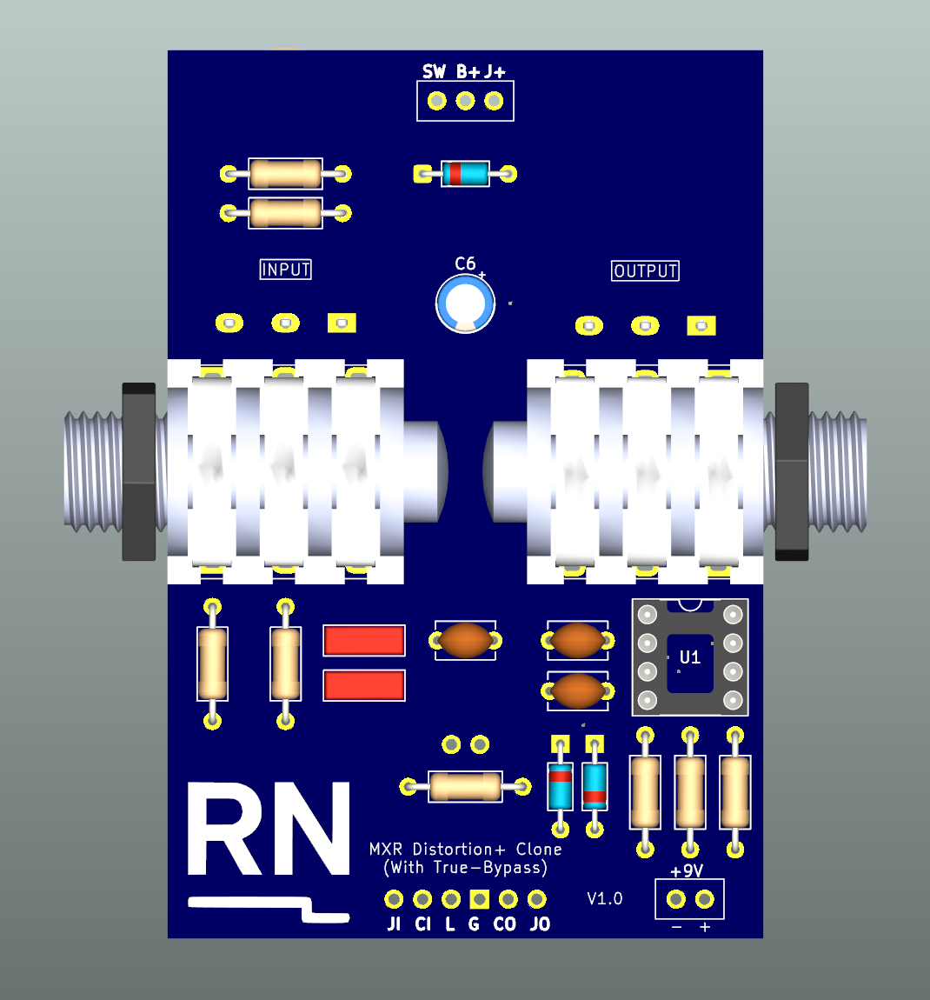
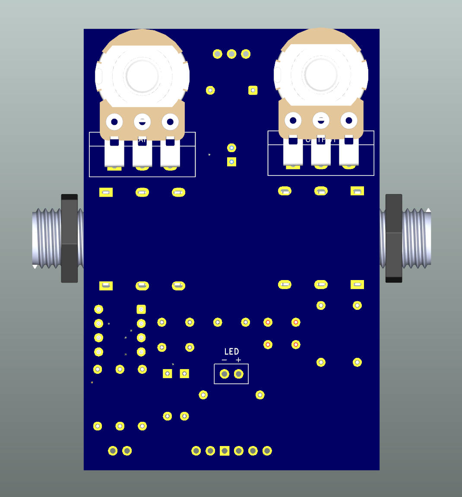
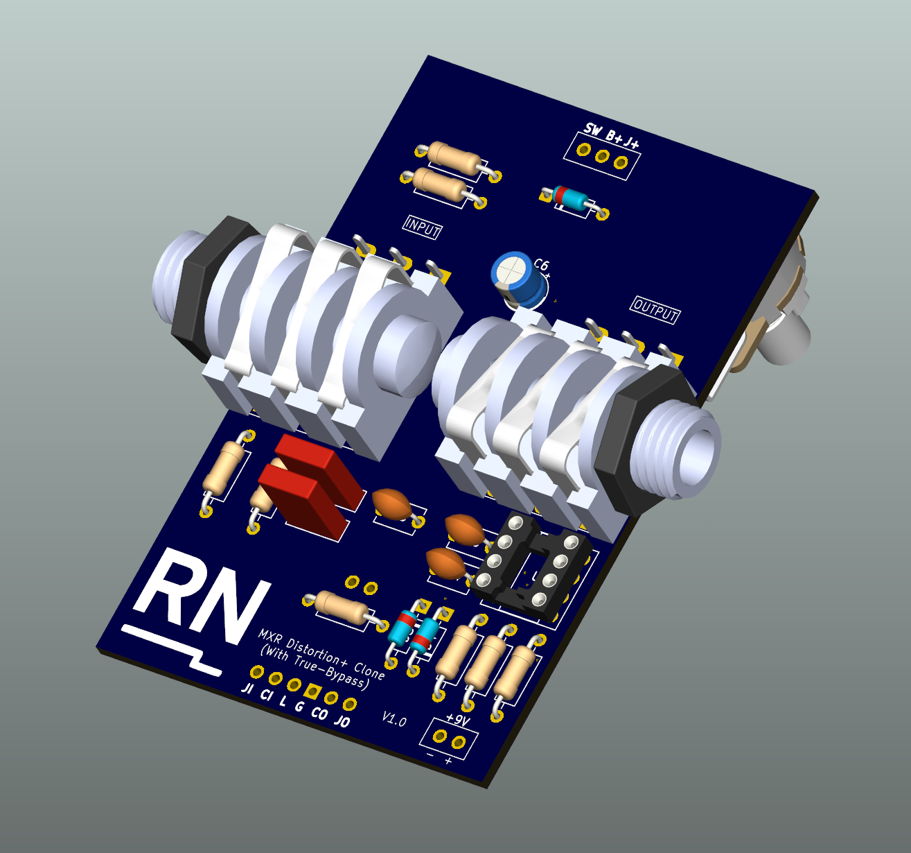
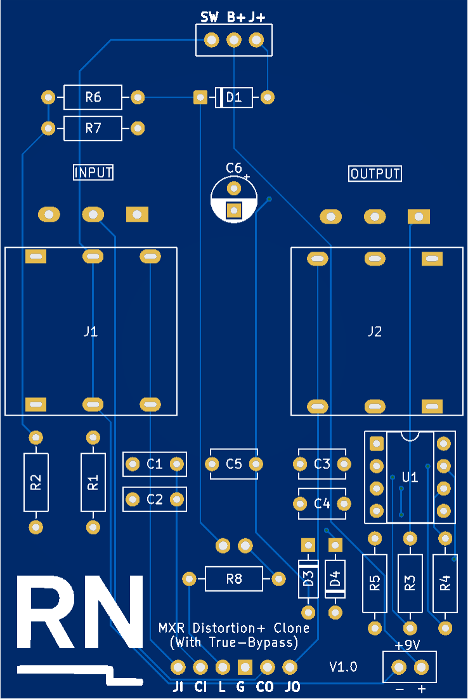
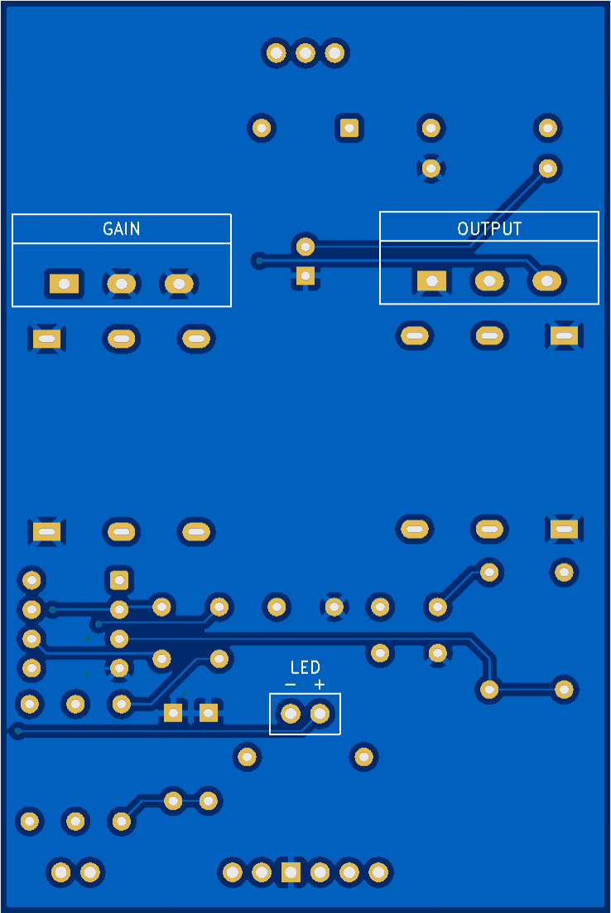
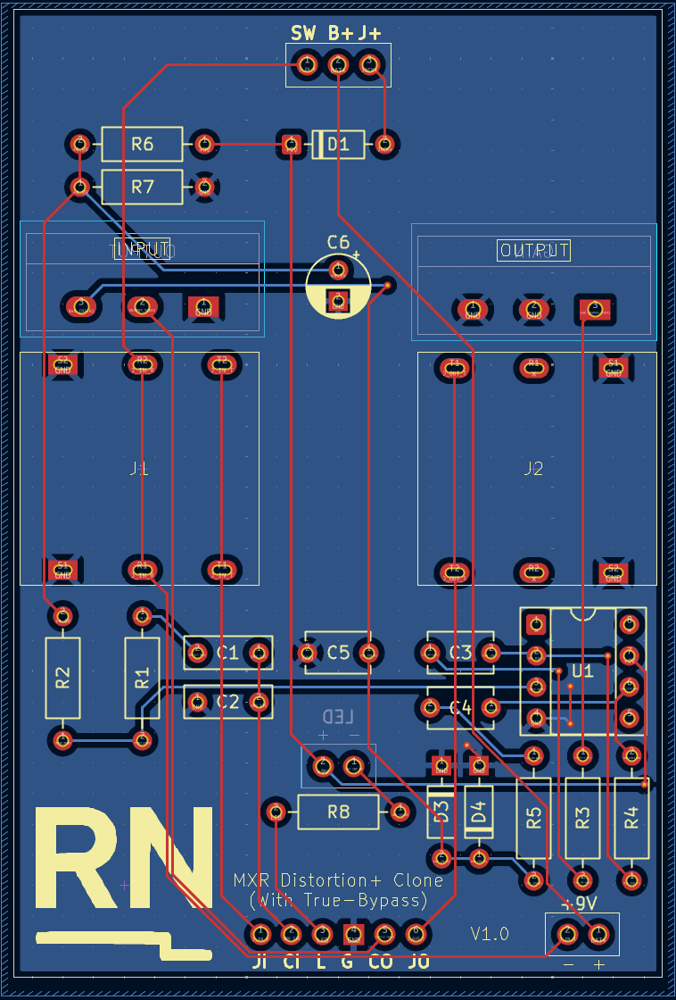

# MXR Distortion+ Clone

A recreation of the classic **MXR Distortion+**, an op-amp-based guitar distortion pedal using **germanium diode clipping** for warm, vintage overdrive characteristics.  
This version was redesigned in **KiCad** to practice schematic capture, PCB layout, and design-for-manufacture (DFM) techniques for analog effects circuits.

---

## Project Overview

- **Type:** Analog audio effect (distortion)  
- **Category:** Classic guitar pedal practice project  
- **Software:** KiCad 9  
- **Fabrication:** JLCPCB (2-layer FR4 board)  
- **Status:** Awaiting PCB fabrication and assembly  

---

## Features

- Compact through-hole layout  
- **True-bypass** footswitch wiring  
- **Input jack power switching**  
- 9V DC operation with reverse-polarity protection  
- Designed for enclosure integration  
- Classic **LM741** op-amp distortion topology  

---

## Visuals

### 3D Renders (KiCad)

**Front and Back Views**

| Front | Back |
|:--:|:--:|
|  |  |

**Isometric View**

---

### PCB Layouts

**Front and Back**

| Front | Back |
|:--:|:--:|
|  |  |

**Routing View**

---

## Schematic

- [View PDF](schematics/schematic.pdf)

---

## Learning Objectives

- Refine analog audio PCB layout techniques  
- Explore op-amp gain stages and diode clipping behaviour  
- Practice integrating mechanical and electrical constraints for enclosures  
- Apply DFM considerations for low-cost prototyping  

---

## Notes

This project is for educational and personal development purposes only.  
It is not affiliated with or endorsed by MXR or Dunlop Manufacturing.  
All schematic capture, layout, and integration were carried out independently.
